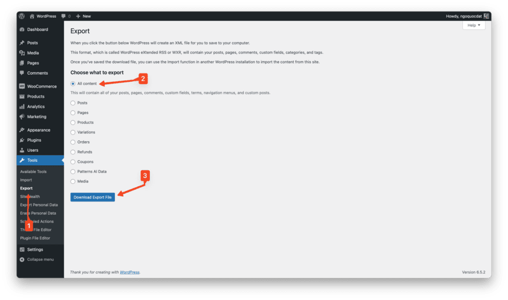
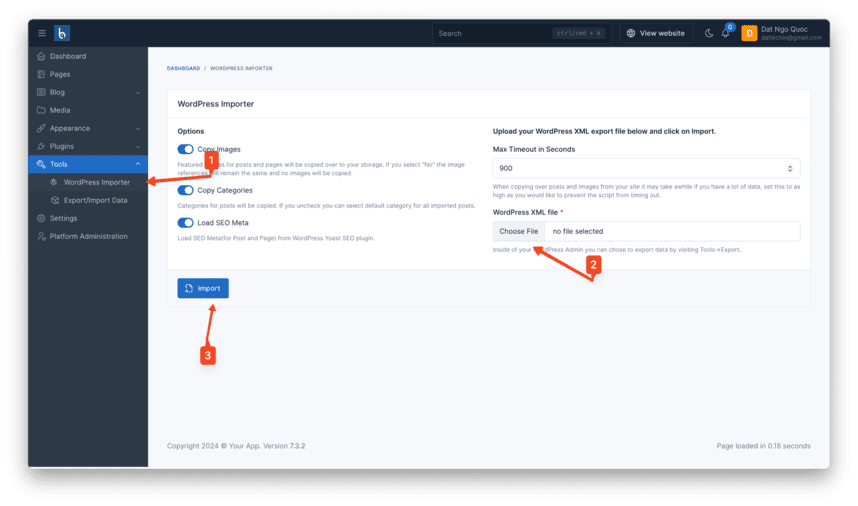
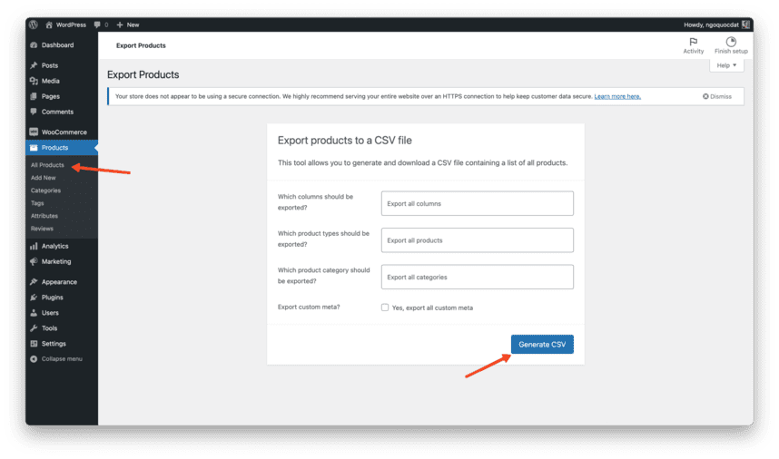
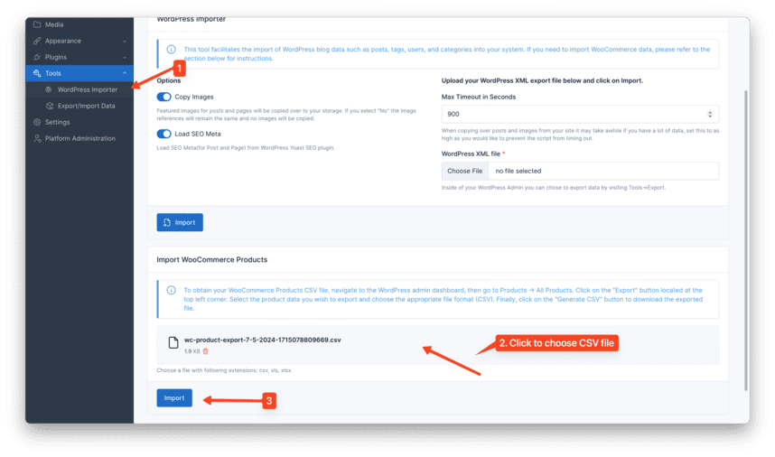

# Overview

This is a plugin for Botble CMS, so you have to purchase Botble CMS first to use this plugin.
Purchase it
here: [https://codecanyon.net/item/botble-cms-php-platform-based-on-laravel-framework/16928182](https://1.envato.market/LWRBY)

# Installation

## Install via Admin Panel

Go to the **Admin Panel** and click on the **Plugins** tab. Click on the "Add new" button, find the **WordPress Importer**
plugin and click on the "Install" button.

## Install manually

1. Download the plugin from
   the [Botble Marketplace](https://marketplace.botble.com/products/botble/wordpress-importer).
2. Extract the downloaded file and upload the extracted folder to the `platform/plugins` directory.
3. Go to **Admin** > **Plugins** and click on the **Activate** button.

## Usage

### Import Base Data

This option imports essential data such as pages, posts, tags, categories, and users.

1. To obtain the XML file for importing data, go to your **WordPress admin panel**.
2. Navigate to **Tools** > **Export**.
3. Select All content and click the **Download Export File** button.
    
4. Once you've downloaded the XML file, go to your **Botble admin panel**.
5. Navigate to **Tools** > **WordPress Importer**.
6. Click on the **WordPress XML file** field to choose the XML file you just downloaded.
7. Click the **Import** button.

### Import WooCommerce Products

To import WooCommerce products to your Botble ecommerce site:

1. Ensure your script supports Ecommerce features, including having an **Ecommerce** plugin and compatible themes.
2. Export the products CSV file from your **WordPress admin dashboard**.
   - Go to **Products** > **All Products**.
   - Click on the **Export** button in the top left corner.
   - Then click **Generate CSV**.
    
4. After exporting the CSV file, go to your **Botble admin panel**.
5. Navigate to **Tools** > **WordPress Importer**.
6. Click on the upload area to select the CSV file you just downloaded.
7. Click the **Import** button.

# Contact us

- Website: [https://botble.com](https://botble.com)
- Email: [contact@botble.com](mailto:contact@botble.com)
