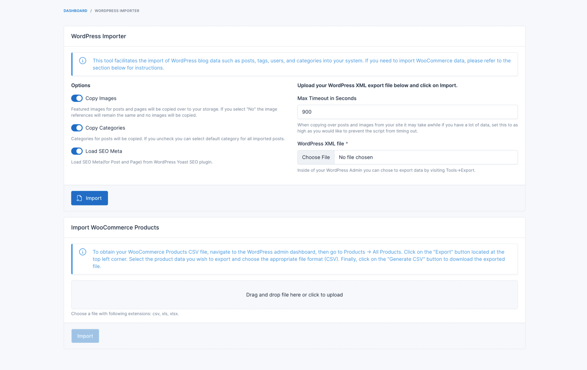

# Overview

This is a plugin for Botble CMS, so you have to purchase Botble CMS first to use this plugin.
Purchase it
here: [https://codecanyon.net/item/botble-cms-php-platform-based-on-laravel-framework/16928182](https://1.envato.market/LWRBY)

# Installation

## Install via Admin Panel

Go to the **Admin Panel** and click on the **Plugins** tab. Click on the "Add new" button, find the **WordPress Importer**
plugin and click on the "Install" button.

## Install manually

1. Download the plugin from
   the [Botble Marketplace](https://marketplace.botble.com/products/botble/wordpress-importer).
2. Extract the downloaded file and upload the extracted folder to the `platform/plugins` directory.
3. Go to **Admin** > **Plugins** and click on the **Activate** button.

# Screenshots

# Contact us

- Website: [https://botble.com](https://botble.com)
- Email: [contact@botble.com](mailto:contact@botble.com)
